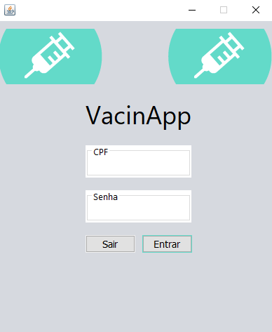
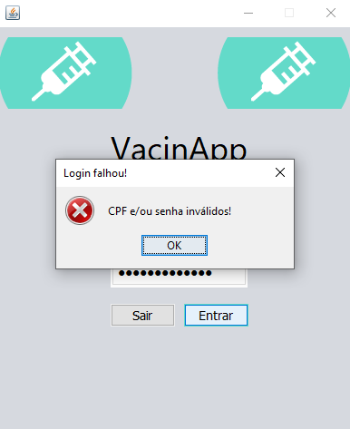
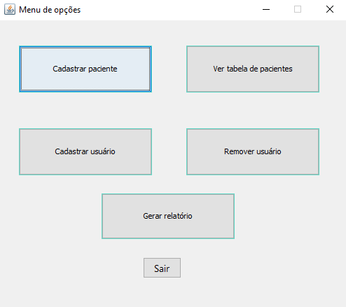
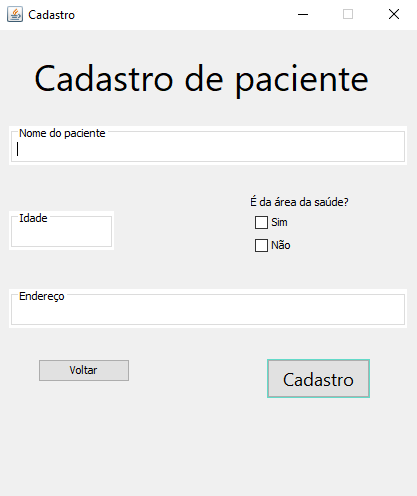
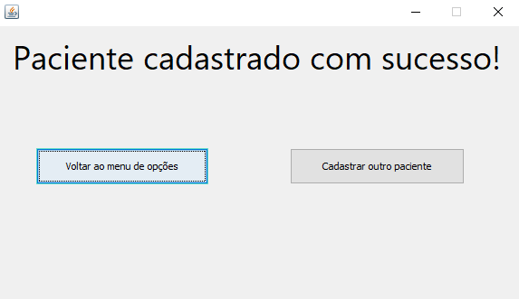
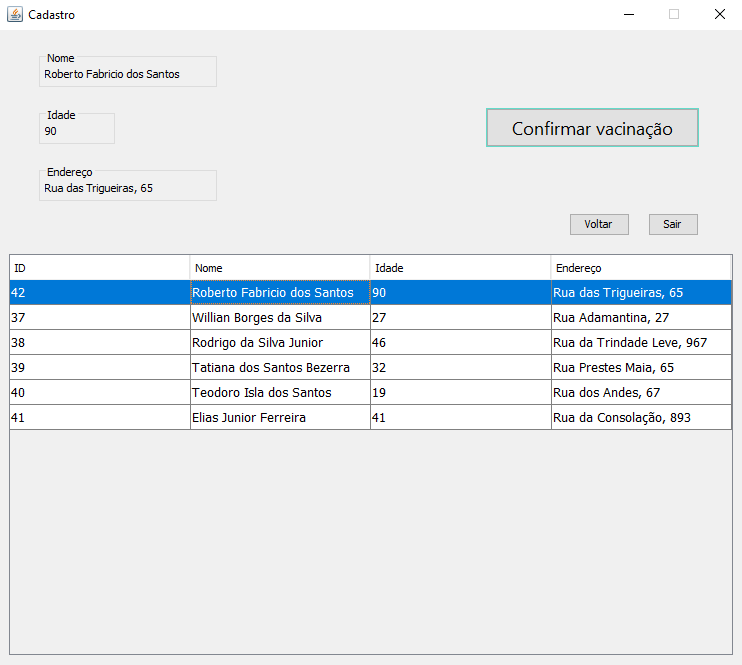
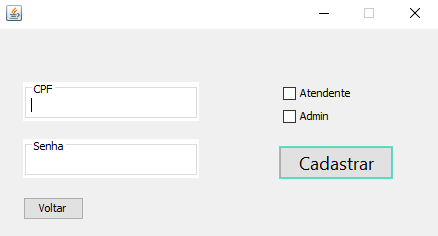
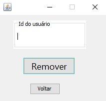
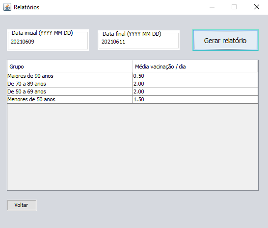

# VacinApp :syringe:

O software conta com **diversas** funcionalidades, para administrador e atendente.

Começando pela **tela de login:**

A tela de login funciona da seguinte maneira: se o CPF e senha do usuário estiver **cadastrado** no sistema o login será validado. Porém, existe a diferenciação de quem é administrador e quem é atendente, o administrador tem um **true** no banco e o atendente tem um **false**!

Aviso de **falha de login:**

Está e a mensagem que aparece caso o **usuário não seja encontrado no banco de dados**!

Após o login de **administrador** será o **menu de opções** a nossa próxima tela:

Nele há diversas funcionalidades destinadas ao administrador do sistema, vou te mostrar cada uma delas! :smile: 

**Cadastrar paciente:**

O cadastro é validado através de nome, idade, se é ou não da área da saúde e endereço do **paciente**! Lembrando que se o paciente que será cadastrado já tiver um cadastro no sistema, dará um **erro** na tela e o administrador não poderá o cadastrar.

Após o cadastro do paciente, temos uma nova telinha que te dará **duas opções**:

**Ver tabela de pacientes:**

A tabela de pacientes funciona da seguinte maneira: paciente **acima de 70 anos tem prioridade 1 (maior prioridade)**, paciente **da área da saúde tem prioridade 2** e paciente que **não cumpre nenhum dos dois requisitos listados tem prioridade 3 e fica por último na fila.**

**Cadastrar usuário:**

O administrador também tem a função de cadastro de usuários do sistema, precisando apenas informar CPF, senha e a caixa de funcionalidade do usuário!

**Remover usuário:**

E não deixando de lado os famosos cancelamentos o adm também pode remover um usúario do sistema através de seu ID no banco de dados (por questões de segurança).

**Gerar relatório:**

A geração de relatórios trás do banco de dados a **média de vacinação diária** de diversas faixas etárias à partir da data inicial e final escolhida pelo adm!

**Atendente**

Deixando um pouco de lado esse administrador chato vamos falar de quem fura as pessoas e salva diversas vidas agindo na linha de frente contra a Covid-19!

Após o login do Atendente no sistema, o mesmo cai direto na tela da **Fila de vacinação** podendo assim **Confirmar vacinação** do paciente, após essa confirmação o paciente entra como vacinado no banco de dados, é retirado automaticamente da fila e ganha também no banco a **data de vacinação** para o administrador poder gerar os relatórios de vacinação!

**O VacinApp foi um software desenvolvido para um trabalho semestral da Universidade São Judas Tadeu e apresentado na Expo São Judas!** 

